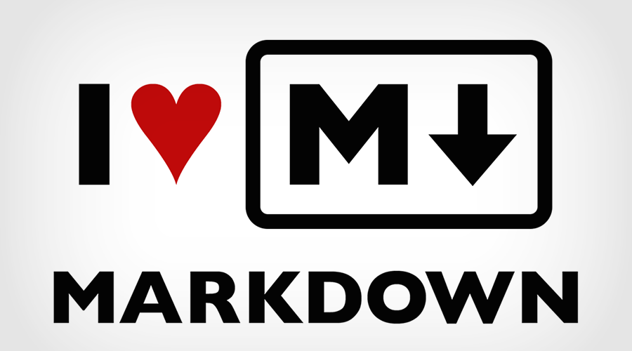
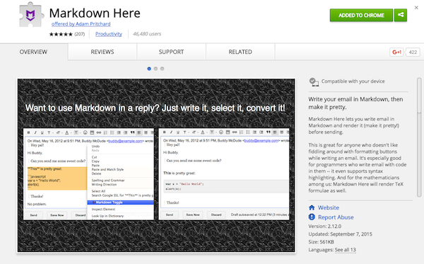
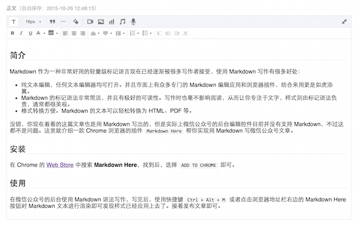

##简介

Markdown 作为一种非常好用的轻量级标记语言现在已经逐渐被很多写作者接受，使用 Markdown 写作有很多好处：

- 纯文本编辑，任何文本编辑器均可打开。并且市面上有众多专门的 Markdown 编辑应用和浏览器插件，结合来用更是如虎添翼。
- Markdown 的标记语法非常简洁，并且有极好的可读性。写作时也毫不影响阅读，从而让你专注于文字，样式则由标记语法负责，通常都很美观。
- 格式转换方便。Markdown 的文本可以轻松转换为 HTML、PDF 等。

没错，你现在看着的这篇文章也是用 Markdown 写出的，但是实际上微信公众号的后台编辑控件目前并没有支持 Markdown，不过这都不是问题。这里就介绍一款 Chrome 浏览器的插件 `Markdown Here` 帮你实现用 Markdown 写微信公众号文章。

##安装
在 Chrome 的 [Web Store](https://chrome.google.com/webstore/category/apps?hl=en-US)(https://chrome.google.com/webstore/category/apps?hl=en-US) 中搜索 **Markdown Here**，找到后，选择 `ADD TO CHROME` 即可。

##使用
在微信公众号的后台使用 Markdown 语法写作，写完后，使用快捷键 `Ctrl + Alt + M` 或者点击浏览器地址栏右边的 Markdown Here 按钮对 Markdown 文本进行渲染即可发现样式已经应用上去了。接着发布文章即可。

