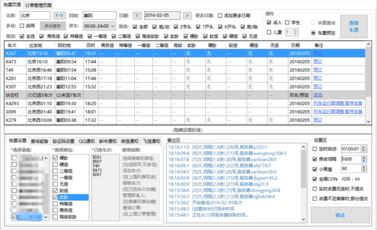
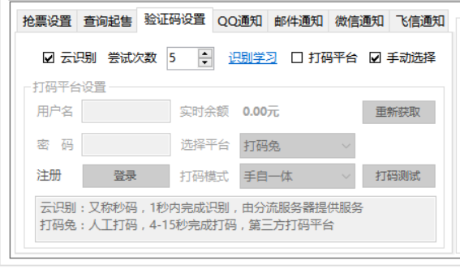

春运的火车票已经开放购买好多天了，但是票还是那么难抢，据说 92% 的人败给过那些丧心病狂的验证码。

这样的：

还有这样的：

以前验证码是那种 abcd 之类的字符类，虽然黄牛懂技术，谁也拦不住，但是猎豹、360 之类的浏览器抢票插件也能帮我们自动识别和抢票，所以大家和黄牛的差距多多少少要小一些，还有机会。而现在，验证码已经做到连人类都无法识别的程度，猎豹、360 都爱莫能助了，我们已经被黄牛甩开。但为什么这些验证码没拦住黄牛呢？因为黄牛们有云打码平台，还有劳动力密集型的**人工打码**！只能感叹：在利益的驱使下，人类的智慧是无穷的！

不过好在我们也是能找到神器的，它是长这样的：

它有这些特性：

- **免费**，支持 Windows 平台。
- 可以同时添加多个车次、多名乘客、多个日期、多个席别进行抢票。
- 支持抢学生票和儿童票。
- **最爽的是：支持验证码云识别和打码平台，躺着刷票，再也不需要你来面对丧心病狂的验证码了。**不过打码平台需要一些花费。
- **最重要的是：真的可以抢到票！**

因为一些你懂的原因，不好在这里直接提供更多关于这个神器的信息了，需要的同学请回复「回家」获取神器和详细教程。

长按下面二维码来订阅我：

