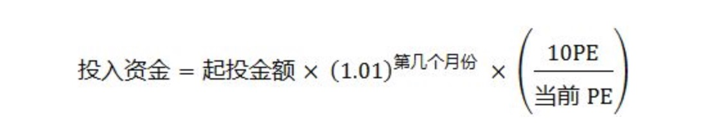
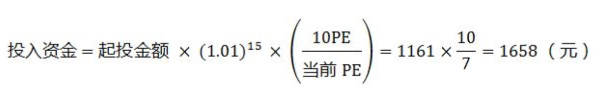

由雪球大 V 「银行螺丝钉」出品的《指数基金投资指南》介绍了针对指数基金的较为完整的投资策略，包括了对「买什么/卖什么」、「如何买/如何卖」等问题的解答。本文是对书中内容的一个简要整理。

## 概念

### 指数基金是什么

什么是「股票指数」和「指数基金」？

- 股票指数：当我们需要了解一个市场的整体情况时，我们可以对市场内的个体价值采用加权平均的方式来反映市场平均水平。对于股票市场来说，股票指数则是对某一些股票的加权平均值。比如：「沪深 300 指数」就是对其中 300 只股票的股价，按照各自的权重比例，加权平均计算而来。股票指数是有由「证券交易所」或者「指数公司」开发而来。比如：上证系列指数是由上海证券交易所开发；深圳系列指数是由深圳证券交易所开发；中证系列指数是由中证指数公司开发。香港的恒生指数、H 股指数，美国的纳斯达克指数、标普 500 指数、道琼斯指数都是由相应的交易所或公司开发而来。
- 指数基金：这里先说一下「基金」，基金可以简单理解为一个篮子，里面可以按照预先设定好的规则装入各种各样的资产。这样做的好处是可以把一篮子资产分割为若干小份，一小份才价值几元钱，这样较少的资金就可以投资了，则适合于更普遍的用户。比如：装入各种短期债券、短期理财、现金的基金就是货币基金；装入各种企业债、国债的基金就是债券基金；装入各种公司的股票的基金就是股票基金；装入股票和债券的基金就是混合基金。这里说的「指数基金」则是选取某个股票指数作为模仿对象，按照该指数构成的成分股比例购买其包含的证券市场的全部或部分证券，这样就能复制指数的走势。

指数是一个数学公式，要将其变为可以买入卖出的金融产品，实现起来还是会有误差的，而这些误差的背后则是投资风险。

- 指数基金的误差与风险：
	- 指数基金的业绩比较基准。有的指数基金，其业绩比较基准并不是其对应的指数。
	- 指数基金的仓位。未满仓导致的追踪误差。
	- 不同渠道的指数基金导致的管理费用等。一般场内基金比场外基金的费率低，误差更小。
	- 汇率风险。跨境指数基金的汇率风险。
	- 指数基金规模和运作历史。规模越大，运作时间越长，归属大公司的指数基金，在应对流动性危机或大额申购赎回时表现会更好。注意尽量避免上市未满一年的基金，或者有长时间拖延建仓的恶性基金公司。

基于这些误差和风险，在投资指数基金时，最好选择最为稳健的「宽基指数基金」。

- 宽基指数：美国证券期货交易所对「宽基指数」的定义是：如果指数包括 10 只以上的股票，单个成分股权重不超过 30%，权重最大的 5 只股票累计权重不超过指数的 60%，并且成分股日均交易额超过 5000 万美元，那这个指数可以称为宽基指数。

### 指数基金的估值

估值的意义是在于了解当前投资目标的价值是处于哪个阶段：高估、正常、低估，从而为你的投资行为提供参考。指数基金中的资产主要是股票，所以我们需要了解股票估值的相关概念：

1）市盈率

- 市盈率(PE)：即`公司市值/公司盈利`，PE = P/E。按照取用的盈利的不同分为：静态市盈率、动态市盈率和滚动市盈率。其中静态市盈率是取公司上一个年度的净利润，动态市盈率是取用预估的公司下一年度的净利润，滚动市盈率是取用最近四个季度财报的净利润。最具有参考意义的是静态市盈率，这也是我们通常所说的市盈率。
- 市盈率的意义：**市盈率反映了我们愿意为获取一元的净利润付出多少代价。**比如一个公司的市盈率是 10，就代表我们愿意为这个公司 1 元的盈利付出 10 元投资。市盈率衡量着盈利的溢价，通常，市盈率越低，越适合投资。
- 市盈率的适用范围：**流通性好，盈利稳定的品种。**市盈率包括两个变量：市价和盈利。所以应用市盈率的前提有两个，一是流通性好能够以市价成交，而是盈利稳定不会有太大的波动。

2）市净率

- 市净率(PB)：即`每股股价/每股净资产`，也就是我们说的账面资产。
- 影响市净率的因素：
	- 企业运作资产的效率：净资产收益率(ROE，即`净利润/净资产`)。ROE 越高的企业，资产运作效率越高，市净率也就越高。
	- 资产的价值稳定性。资产价值越稳定，市净率有效性就越高。资产的种类多种多样，有的随时间增值，有的随时间贬值。比如酿造的白酒随时间增值，生产的电脑芯片随时间贬值。
	- 无形资产。有形资产例如：地皮、矿山、厂房、原材料等。无形资产例如：企业品牌、高级技术工程师、专利、渠道影响力、行业话语权等。如果一个企业主要靠无形资产来经营，那市净率就没多少参考价值了。比如律师事务所、广告服务公司、互联网公司等。
	- 负债大增或亏损。净资产是公司的资产减去负债。所以公司的负债不稳定也会影响到净资产，从而影响市净率。
- 市净率的意义：市净率衡量着净资产的溢价，通常，市净率越低，越适合投资。
- 市净率的适用范围：
	- 资产大多比较容易衡量价值并且长期保值的企业的股票很适用于市净率。比如持有工厂、土地、铁路、存货等资产的企业。
	- 周期性行业的企业的资产主要是有形资产并且长期保值，那这个企业的股票很适合用市净率估值。比如证券、航空、航运、能源等企业。
	- 宽基指数基金遇到短期的经济危机，盈利不稳定，也可以用市净率来辅助估值。

3）股息率

「股息率」和「分红率」两个概念很像，但是其实不同。

- 股息率：即`企业过去一年现金派息额/公司的总市值`。股息率会随着股价波动：股价越低，股息率越高。
- 分红率：即`企业过去一年现金派息额/公司的总净利润`。分红率一般由公司预先设置好，并且连续多年不会有什么改变。比如工商银行的分红率在 50%，即把过去一年的净利润的 50% 以现金形式派息。

股息率是投资者在不减少所持有的股权资产的前提下，直接分享企业业绩增长的最佳方式。

4）盈利收益率

- 盈利收益率：格雷厄姆估值方法的核心指标：「盈利收益率」，`盈利收益率 = 股票盈利 / 股票价值`，即市盈率的倒数。这是《指数基金投资指南》一书中主要采用的指数基金估值指标。盈利收益率这种表达方式，让我们可以方便地将指数基金与债券利率、其他指数基金的盈利收益率、房地产租售比、银行理财的年收益率等等进行横向比较，从而选出最值得投资的一类。
- 影响盈利收益率的因素：
	- 短期的股价波动，股价越低，盈利收益率越高。
	- 长期的成长性，成长性越强，盈利收益率涨的越快。
- 盈利收益率的适用范围：前面说过，流通性好、盈利越稳定的品种适合用市盈率来估值，这点也适用于盈利收益率。大部分的宽基指数，盈利都比成分股要稳定的多，所以适合用盈利收益率来衡量估值。如果成长性也相近，那就可以互相比较盈利收益率来发掘投资价值。大多数国家的股市指数都适用格雷厄姆的这套估值方法，比如：标普、纳斯达克、沪深 300、MSCI 中国指数、上证 50、H 股指数、红利指数等等。

4）指数基金的估值

想要查看指数基金的估值，可以：

- 1）关注雪球账号：[银行螺丝钉](http://xueqiu.com/3079173340)，每个交易日晚上会公布当天收盘后的指数基金市盈率与市净率估值。
- 2）查询：[中证指数官网](http://www.csindex.com.cn/sseportal/csiportal/zs/jbxx/daily_index_info.jsp)(http://www.csindex.com.cn/sseportal/csiportal/zs/jbxx/daily_index_info.jsp)。
- 3）查询：[申万历史数据](http://www.swsindex.com/idx0510.aspx)(http://www.swsindex.com/idx0510.aspx)。

## 当下推荐的指数基金

### H 股指数

这是由恒生指数公司编纂的恒生国企指数，它追踪的是恒生 H 股指数，主要是国内大型国企在香港上市的 H 股，主要成分股与上证 50 的成分股类似，基本可以看做对标。

- 易方达公司的 H 股 ETF(510900)，是目前追踪 H 股的 ETF 中规模最大流动性最好的。

### 上证 50 指数

上证 50 指数是标准的蓝筹股指数，可以说是蓝筹中的蓝筹。挑选了上海证券市场规模大、流动性好的 50 只股票组成，是以市值为主要权重的指数。

- 华夏上证 50 ETF(510050)，是目前追踪上证 50 指数规模最大的一只指数基金，规模、流动性、误差都不错。

### 恒生指数

恒生指数代表的是港股的蓝筹股，从香港交易所的所有上市公司中，选出 50 家规模最大、流动性最好的公司组成，用来反映香港股市的整体水平，单个成分股的最高比例是 15%；同时他也是一个交易指数，围绕恒生指数成立了一系列的金融衍生品，所以恒生指数也非常注重流动性。

- 华夏公司的恒生 ETF(159920)，采用沪港通渠道建立的 ETF。华夏公司在减少 ETF 误差方面比较有心得，而且作为老牌基金公司，在基金运作上也更有经验。

### 红利指数

前面介绍的几个都是以市值为主要权重的指数，这里介绍一只策略加权指数：红利指数。

通常来说，策略加权的指数大多可以跑赢同等定位的市值加权指数基金。红利指数使用的策略是高股息策略，它挑选了上证交易所过去两年现金分红最高、市值最大、流动性最好的 50 只股票。一般 A 股分红高的股票大多是一些成熟行业的蓝筹股，所以可以把红利指数看做是一个蓝筹股指数。

- 红利 ETF(510880)，市场上追踪红利指数的 ETF。

## 指数基金投资策略

### 买什么/卖什么

买什么/卖什么要解决的是对投资品种的选择，在这里就是我们要不要投资一个指数基金，还是投资别的(比如：房产)。

**1）买入时机：当一个指数基金的盈利收益率大于 10%，并且盈利收益率大于国债利率 2 倍以上时，才会考虑买入这个指数基金。**

**2）卖出时机：只有当我们能够找到比股票盈利收益更高的稳健品种时，才会考虑卖出股票、指数基金。**

### 如何买/如何卖

如何买/如何卖要解决的是当我们投资指数基金时的具体策略是什么。

这里推荐采用「定期不定额」的投资策略：定期是指投资频率，比如每月一次；不定额是指投资金额，投资额度需要和指数基金的盈利增长速度接近，这里采用不定额而非定额的原因是长期来看通货膨胀、指数上涨等原因导致定额买入指数基金的份额是在逐渐缩水。

**1）想好自己在哪个估值区域买入，哪个估值区域持有，哪个估值区域卖出。**

判断低估、高估是基于前面提到的格雷厄姆的策略，并结合各个指数自身的特点。

比如沪深 300 指数和恒生指数，它们的主要估值集中在 10~18PE，低于 10 PE 就是低估区域，这时就不断买入；处于 10~18PE，则持有；高于 18 PE，则分批卖出。

**2）设置起始投资金额。**

假设沪深 300 指数跌倒了买入区域 10 PE 以下，我们就开始第一次定投，这时的金额就是起始金额。比如 1000 元。

这个起始金额每年增长约 12% 或者每个月增长 1% (大多数宽基指数的长期成长性约为 12%)，保持投资额度与指数基金的盈利增长速度接近。例如定投的第 2 年，如果沪深 300 指数又到了 10 PE，这时候我们该投入的资金量就变成了 1120(`1000*(1+12%)`) 元。

**3）设置波动公式。**

如果之后在定投的时候，沪深 300 指数 PE 下跌到 7 PE，那我们可以用下面这个公式来计算应该定投的资金：

例如到了定投的第二年第三个月，沪深 300 跌倒了 7 PE，那么：

如果资金量还有余力，可以调整系数，比如：`投资资金=1161*(10/7)^2=2369元`，这样在指数下跌后投入的资金会以几何倍数提升，在低估区域买入的份额更多，代价就是要拿出更多的收入来定投。

对于卖出，则也是同样的策略，不过是反方向而行。预先想好自己会在什么估值开始卖，然后跟定期买入一样，定期卖出。并且随着估值的升高加大卖出额度，实现更高的平均卖出价格，获得更高的收益。

## 执行

前面已经将指数基金投资的大多数理论知识和策略都介绍过了，接下来就看你的执行了，股市有风险，投资需谨慎。

一份完整的定投计划，需要根据自己的收入和开支构建合理的每月定投额度；需要筛选适合的投资品种；需要设定好买卖区间，最终需要把这些计划落实和执行下去。

上文只是对《指数基金投资指南》的一个简要整理，对于更为详细和全面的内容，请阅读原书。

